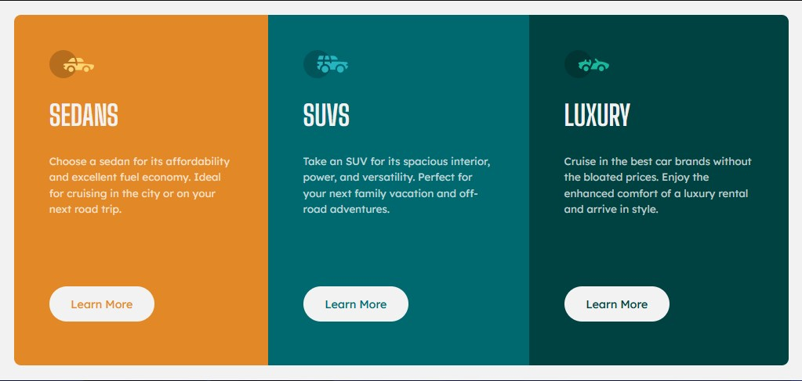

# Frontend Mentor - 3-column preview card component solution

This is a solution to the [3-column preview card component challenge on Frontend Mentor](https://www.frontendmentor.io/challenges/3column-preview-card-component-pH92eAR2-). Frontend Mentor challenges help you improve your coding skills by building realistic projects. 

## Table of contents

- [Overview](#overview)
  - [The challenge](#the-challenge)
  - [Screenshot](#screenshot)
  - [Links](#links)
- [My process](#my-process)
  - [Built with](#built-with)
  - [What I learned](#what-i-learned)
  - [Continued development](#continued-development)  
- [Author](#author)

## Overview

### The challenge

Users should be able to:

- View the optimal layout depending on their device's screen size
- See hover states for interactive elements

### Screenshot

### Links

- [Solution URL](https://www.frontendmentor.io/solutions/3column-preview-card-component-challenge-solution-r9mzvweKqr)
- [Live Site](https://6xg0d.github.io/3-column-preview-card-challenge/)

## My process

Pretty easy, i'm starting to get confidence with the knowledgment i'm getting! :)

### Built with

- Semantic HTML5 markup
- CSS
- Flexbox
- Mobile-first workflow

### What I learned

Practicing the fundamentals.

### Continued development

i'd like to set the buttons at the same position without using margins. i think isn't the best way due to responsive in different screen sizes.

## Author

- Frontend Mentor - [@6xg0d](https://www.frontendmentor.io/profile/6xg0d)
